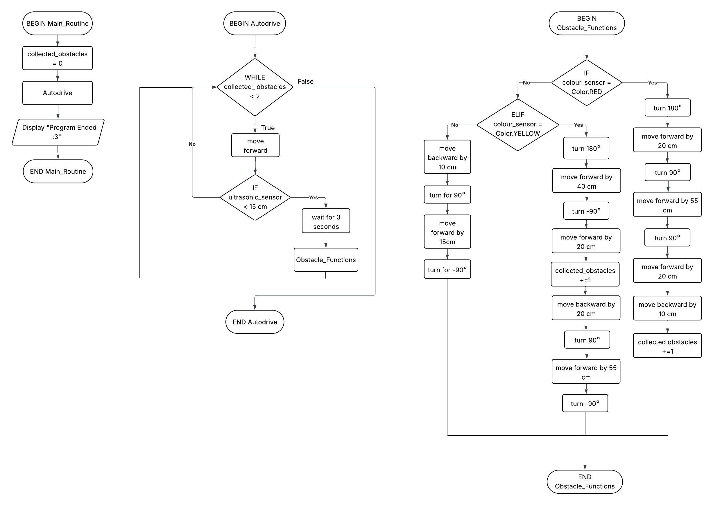

# 9CT Assessment Task 1
### *By Arisa Komatsu*

## **Requirements Outline**
I need to design a program for the EV3 MINDSTORMS robot to allow it to identify and collect the yellow and red blocks back to the start zone using the colour sensor whilst navigating past other obstacles (green and blue blocks) using the ultrasonic sensor to detect obstacles and adjust its path automatically.
>### **Key Actions**
>1. Move forward until an obstacle is detected.
>2. Move back and turn 90° from obstacle if the obstacle is green or blue.
>3. Continue moving forward if an obstacle is red or yellow, then turn 180°.
>4. Robot moves forward in a set 'return' path corresponding to colour when red or yellow obstacle is 'captured'.
### **Functional Requirements (of key actions)**
>1. Obstacle Detection - Use Case

Scenario: The robot is navigating a path and encounters an obstacle.

Inputs: The ultrasonic sensor detects an object within 10 cm.

Action: The robot moves forward until an obstacle is detected.

Expected Outcome: The robot stops moving.

>2. Green/Blue Obstacle Evasion - Use Case

Scenario: The robot is has stopped moving after encountering an obstacle.

Inputs: The colour sensor detects the obstacle is green or blue.

Action: The robot moves backward, turns 90° from the obstacle, moves 15 cm, then turns 270° and continues moving forward until an obstacle is detected.

Expected Outcome: The robot avoids the green/blue blocks.

>3. Red/Yellow Obstacle Capture - Use Case

Scenario: The robot has stopped moving after encountering an obstacle.

Inputs: The colour sensor detects the obstacle is red or yellow.

Action: The robot moves forward until ultrasonic sensor detects the obstacle is within 0 cm, then turns 180° and continues moving forward until an obstacle is detected.

Expected Outcome: The robot captures the red/yellow obstacle in its 'arms'.

>4. Return Path after Capture - Use Case

Scenario: The robot has 'captured' a red or yellow obstacle (0 cm distance with obstacle).

Inputs: n/a (The colour sensor has already detected if the obstacle is either red or yellow)

Action: The robot moves forward until ultrasonic sensor detects the obstacle is within 0 cm, then turns 180° and continues moving forward until an obstacle is detected.

Expected Outcome: The robot captures the red/yellow obstacle in its 'arms'.
| Test Case | Input     | Expected Output   |
|---------- |---------- |----------------   |
| 1. Obstacle Detection          | Ultrasonic sensor detects obstacle           | The robot stops moving.                  |
| 2. Green/Blue Obstacle Evasion          | Colour sensor detects obstacle is green/blue           | The robot avoids the green/blue obstacle.                  |
| 3. Red/Yellow Obstacle Capture          | Colour sensor detects obstacle is red/yellow          | The robot captures red/yellow obstacle in its 'arms'.                 | The robot captures red/yellow obstacle
| 4. Return Path after Capture | n/a |The robot moves (with red/yellow obstacle) back to start zone, stops and turns 180°.
### **Non-Functional Requirements**
- Efficiency - The robot should be able to complete the task within 2-3 minutes.

- Response Time - The robot should respond to sensor input(for both ultrasonic and colour sensor) within 1 second.

- Accuracy - The red and yellow blocks should be transported back to the start area  with all or most of its area within the box.

- Recognition - The robot should be able to identify when it needs to retrieve one more obstacle(red/yellow).


## **Design**
### **Pseudocode Development**
```
    BEGIN Main_Routine
        collected_obstacles = 0
        Autodrive
        Display "Program Ended :3"
    END Main_Routine
```
```
    BEGIN Autodrive
        WHILE collected_obstacles < 2 THEN
            move forwar
            IF ultrasonic_sensor < 15 cm THEN
                wait for 3 seconds
                Obstacle_Functions
            END IF
        END WHILE
    END Autodrive
```
```
    BEGIN Obstacle_Functions
        IF colour_sensor = Color.RED THEN
            turn 180°
            move forward by 20 cm
            turn 90°
            move forward by 55 cm
            turn 90°
            move forward by 20 cm
            move backward by 10 cm
            collected_obstacles += 1
        ELIF colour_sensor = Color.YELLOW THEN
            turn 180°
            move forward by 40 cm
            turn -90°
            move forward by 20 cm
            collected_obstacles += 1
            move backward by 20 cm
            turn 90°
            move forward by 55 cm
            turn -90°
        ELSE 
            move forward by -10 cm
            turn 90°
            move forward by 15 cm
            turn -90°
        END IF
    END Obstacle_Functions
  
```
**Note -**
 I  made the program so it uses the ultrasonic sensor to detect and avoid an obstacle, bring the yellow obstacle back to the start zone and move deliberately adjacent to the red obstacle before it goes to the start of the while loop so it can autodrive directly towards it.

### **Flowchart Development**


## **Testing and Debugging**
###  1. Obstacle Detection (scratched in final code)
| Input | Process | Output|
|---------- |---------- |----------------   |
| Ultrasonic sensor detects obstacle within 15 cm distance | The robot stops, reverses | The robot avoids the obstacle

```
# TEST 1
# Play a beep sound to signal the program has started
ev3.speaker.beep()

# The robot drives continuously unless an obstacle is detected to be within 15 cm
while True:
    robot.drive(200, 0)
    
# If an obstacle is detected within 15 cm, the robot waits 3 seconds, goes back 10 cm, turns to the right, drives 25 cm then turns back to the left to begin driving continuously again.
    if obstacle_sensor.distance() < 150: 
        wait(3)
        robot.straight(-100)
        robot.turn(90)
        robot.straight(250)
        robot.turn(-90)

```
The robot didn't detect the wall fast enough and started rotating and moving on the wall. I think I need to probably make the "obstacle_sensor.distance()" larger so the robot can detect obstacles quickly without bumping into them.

**Working Towards:**
- Making the "obstacle_sensor.distance()" larger so the robot can detect obstacles more quickly
- Changing the "while True" later to "while collected_obstacles < 2" later when I start combining all the test cases.
---
```
# TEST 2
# Play a beep sound to signal the program has started
ev3.speaker.beep()

# The robot drives continuously unless there's a break in the loop
while True:
    robot.drive(200, 0)

# If an obstacle is detected within 30 cm, the robot waits 3 seconds, goes back 10 cm, turns to the right, drives 15 cm then turns back to the left to begin driving continuously again.
    if obstacle_sensor.distance() > 300:
        wait(3)
        robot.straight(-100)
        robot.turn(90)
        robot.straight(150)
        robot.turn(-90)
```
**LATER NOTE:**
 This test case was going to be joined with the green/blue obstacle evasion in the end but we have decided to go with another plan so we will only be needing the first half of this code with the robot driving, detecting the obstacle and pausing.

 > #### Evaluate your process in solving this test case. 
 > I think I was probably most successful for solving this test case particularly because it was the simplest. Most of this test case, including the obstacle being detected and avoiding it, went very well and we only had to do a bit of tweaking for a measurements for it to work well. However, this test case was ***not used in our final program***, as we identified later on that it'd be easier to just code the robot to go directly up to the red/yellow blocks and detect it there, instead of using this test case for the robot to avoid things because otherwise the robot would just continue running off the map after its avoided all obstacles. I think this test case could've been improved so it could avoid obstacles while also checking that it's still on the map, but we didn't have enough time so that's a thought for next time.

###  2. Green/Blue Obstacle Evasion (scratched in final code)
| Input | Process | Output|
|---------- |---------- |----------------   |
| Ultrasonic sensor detects obstacle within 15 cm distance + Colour sensor detects the obstacle is green or blue | Robot reverses, moves sideways, then returns to original path | Robot evades green and blue obstacles
```
# TEST 1
# Play a beep sound to signal the program has started
ev3.speaker.beep()

# The robot drives continuously unless there's a break in the loop
while True:
    robot.drive(200, 0)

    # If an obstacle is detected within 30 cm, wait 3 seconds
    if obstacle_sensor.distance() < 300:
        wait(3)
        # If the colour sensor detects blue, beep twice then break the while loop
        if colour_sensor.color() == Color.BLUE:
           ev3.speaker.beep()
           ev3.speaker.beep()
           break
        # If the colour sensor detects green, beep twice then break the while loop
        elif colour_sensor.color() == Color.GREEN:
           ev3.speaker.beep()
           ev3.speaker.beep()
           ev3.speaker.beep()
           break
        else:
           ev3.speaker.beep()
           break
```
I want to begin this test case by first figuring out how to use the colour sensor to make it detect the green and blue obstacles. We tested the code but it goes straight to the else statement, so the issue is probably in how I wrote "colour_sensor.color() == Color.X". 

I did some research and found that the distance and sensor should be pretty close for accurate colour detection so I'll decrease the "obstacle_sensor.distance" as well.

**Working Towards:**
- Figuring out how to make the colour sensor detect both green and blue
- Changing the code to fit my original program plan once I identify and fix the issue (with the colour sensor).
---
```
# TEST 2
# Play a beep sound to signal the program has started
ev3.speaker.beep()

# The robot drives continuously unless there's a break in the loop
while True:
    robot.drive(200, 0)

    # If an obstacle is detected within 15 cm, wait 3 seconds
    if obstacle_sensor.distance() < 150:
        wait(3)
        # If the colour sensor detects blue, beep twice then break the while loop
        if colour_sensor.color() == Color.BLUE:
           ev3.speaker.beep()
           ev3.speaker.beep()
           break
        # If the colour sensor detects green, beep three times then break the while loop
        elif colour_sensor.color() == Color.GREEN:
           ev3.speaker.beep()
           ev3.speaker.beep()
           ev3.speaker.beep()
           break
        else:
           ev3.speaker.beep()
           break
```
We changed the distance to 15 cm, but it still goes to the else statement when we have a green or blue obstacle, so I think its most likely a problem with how I wrote the if and elif statements. I think I'll do some more research on how to write codes that make the colour sensor detect colour then I'll come back and continue testing this out.

**Working Towards:**
- Researching out how to make the colour sensor detect both green and blue
- Changing the code to fit my original program plan once I identify and fix the issue (with the colour sensor).
---
```
# TEST 3
# Play a beep sound to signal the program has started
ev3.speaker.beep()

# The robot drives continuously unless there's a break in the loop
while True:
   colour = colour_sensor.color()
   robot.drive(200, 0)

    #if obstacle_sensor.distance() < 300:
      #wait(3)
    # If the colour sensor detects blue, beep twice then break the while loop
   if colour == Color.BLUE:
      ev3.speaker.beep()
      ev3.speaker.beep()
      break
    # If the colour sensor detects green, beep three times then break the while loop
   if colour == Color.GREEN:
      ev3.speaker.beep()
      ev3.speaker.beep()
      ev3.speaker.beep()
      break
   #else:
      #ev3.speaker.beep()
      #break
```
We received some help from Mr Scott and the colour sensor works now! Contrary to my previous guesses, the problem wasn't entirely the our code's fault. By isolating just the code that detects the colour and working with that, he found that the colour sensor on our EV3 robot was on light detecting mode instead of colour, which is why our code wouldn't work. 

With his help, now we can start working on adapting this code into our program so the robot can evade blue and green obstacles.

**Working Towards:**
- Changing the code to fit my ~~original~~ new program plan.

> #### Evaluate your process in solving this test case. 
> Overall, I think I was very successful in meeting this test case's requirements as with this test case alone, the robot does avoids the obstacles. However, this test case was ***not in our final program*** as it was unnecessary in our new plan because we had to change the way our robot goes around the path. Some challenges we faced for this test case was with the colour sensor, which we were able to identify it's issue by isolating the colour sensor's function. We found out that the way we coded it made the code break too early in the while code, and we also additionally found out that our robot's settings for the colour sensor was linear instead of colour. I think the robot detecting the obstacle using the ultrasonic sensor and just avoiding it alone went really well, but I believe that this test case could be improved next time particularly around the colour sensor's function.

### 3. Red/Yellow Obstacle Capture + Return Path after Capture (conjoined)

| Input | Process | Output|
|---------- |---------- |----------------   |
| Ultrasonic sensor detects obstacle within 10 cm distance | Robot pauses, moves forward 10-20cm and turns 180 degrees and drives back to the start area (corresponding to red and yellow) | Robot captures red/yellow obstacle within its 'arms' and takes it back to the start area

```
# TEST 1
collected_obstacles = 0

# Play a beep sound to signal the program has started
ev3.speaker.beep()

while collected_obstacles < 2:
  colour = colour_sensor.color()
  robot.drive(200, 0)


  if obstacle_sensor.distance() < 300:
      wait(3)
      if colour == Color.YELLOW:
         robot.straight(100)
         robot.turn(225)
         robot.straight(200)
         robot.turn(140)
         robot.straight(120)
         robot.straight(-30)
         collected_obstacles += 1
```
After testing the robot capturing the yellow, we realised that our colour sensor can't detect the colour from the way we were trying to go as one of the obstacles are in the way. Due to this, we now have to scratch our original plan (and probably the obstacle evasion) and start first by collecting the red obstacle from the left, then the yellow. We also found out that the robot doesn't turn 180 or 90 degrees accurately on the sheet (maybe because of the texture??) so this is actually going to require more testing and time. 

**Working Towards:**
- Getting the robot accurately to the red obstacle (QUICKLY!!)
- Creating the robot's arms so we can afterward start tesing out the robot capturing the red obstacle (by turning 180)
---
```
# TEST 2
# Display ":3" and play a beep sound to signal the program has started
ev3.screen.draw_text(40, 50, ":3")
ev3.speaker.beep()

# The robot drives up so its facing the red obstacle
robot.straight(200)
robot.turn(107)
robot.straight(595)
robot.turn(107)

while True:
   # Robot autodrives using the while code
   robot.drive(50, 0)
   # Once it detects an obstacle within 10 cm
   if obstacle_sensor.distance() < 100:
      wait(2)
      # The robot's screen displays "Obstacle Detected! :0"
      ev3.screen.clear()
      ev3.screen.draw_text(40, 50, "Obstacle Detected! :0")
      break

# If that obstacle is red
if colour_sensor.color() == Color.BLUE:
   # The robot's screen displays "RED Detected! :3"
   ev3.screen.clear()
   ev3.screen.draw_text(40, 50, "RED Detected! :3")
   robot.straight(100)
   robot.turn(196)
   wait(3)      
```      
It goes up to the red obstacle (we had to substitute it for a blue one at the time) and starts auto-driving and checking for an obstacle. For some reason its not really stopping so I'm not sure if it's detecting the obstacle, so we'll mainly be working on it detecting the obstacle and colour next lesson while still tweaking the robot going up to the obstacle. I'm glad we put the screen displays in as it adds a bit of like structure to the code and makes it easier to see which code is for which function.

Yuna also made the arms for us today! We had to adjust it so one of the arms is on the outside of the colour sensor so it when it detects a yellow or red obstacle, it can go straight forward and actually get it inside its arms. I think it's really stable and awesome so I'm hoping it won't need any tweaks later on.

**Working Towards:**
- Further refining the robot's pathway to the red obstacle so it can accurately detect
- Fixing the code so the robot detects the obstacle and stops
- Getting up to testing if the colour sensor is actually working
---
```
# TEST 3
# Beep to signal the program has started
ev3.speaker.beep()

# The robot drives up so its facing the red obstacle
robot.straight(200)
robot.turn(107)
robot.straight(595)
robot.turn(107)

while True:
   # Robot autodrives using the while code
   robot.drive(50, 0)
   # Once it detects an obstacle within 10 cm
   if obstacle_sensor.distance() < 100:
      robot.stop()
      # Its screen displays "Obstacle Detected! :0"
      ev3.screen.clear()
      ev3.screen.draw_text(40, 50, "Obstacle Detected! :0")
      break

# If that obstacle is red
if colour_sensor.color() == Color.RED:
   # Its screen displays "RED Detected! :3"
   ev3.screen.clear()
   ev3.screen.draw_text(40, 50, "RED Detected! :3")
   robot.straight(120)
   robot.turn(196)    
   # Robot going back to start area
   robot.straight(200)
   robot.turn(-107)
   robot.straight(595)
   robot.turn(-107)
   robot.straight(200)

# The robot drives up so its facing the yellow obstacle
robot.straight(200)
robot.turn(107)
robot.straight(670)
robot.turn(107)
robot.straight(450)
robot.turn(107)

while True:
   # Robot autodrives using the while code
   robot.drive(50, 0)
   # Once it detects an obstacle within 10 cm
   if obstacle_sensor.distance() < 100:
      robot.stop()
      # Its screen displays "Obstacle Detected! :0"
      ev3.screen.clear()
      ev3.screen.draw_text(40, 50, "Obstacle Detected! :0")
      break

# If that obstacle is yellow
if colour_sensor.color() == Color.YELLOW:
   # Its screen displays "YELLOW Detected! :3"
   ev3.screen.clear()
   ev3.screen.draw_text(40, 50, "YELLOW Detected! :3")
   # Robot going back to start area
   robot.straight(500)
   robot.turn(-107)
   robot.straight(200)
```
Today our robot didn't run any of the code even when we pressed it. This was similar to something that happened last time and we received help from Mr Scott for that but I don't remember what he did or said to fix it, and he is away in Tasmania.

I'm not really sure how to fix it and I've done some research on how to find what the problem is but we only have two lessons left, which will probably be less than 2 hours since the other class keeps altering our robot, which takes up at least 10-15 minutes of our time. I'm thinking instead of connecting and downloading this file to RickMan, I'll create a separate one with just the 'main.py' in case its a problem with something in this project. 

Sitting there idly not knowing what to do would've been a waste of time, so Vanessa and I created the mock code for the entire program, which is what the code will supposedly look like, with a lot of approximate measurements for the 'robot.straight' and 'robot.turn' as RickMan doesn't turn 90 degrees when you code it to turn 90 degrees (perhaps due to the texture of the surface??). Next lesson, we'll try test it again separate to this project, and if that doesn't work, we'll try receive help from Mr Groom if he's next door. If we can get the code to work, we'll tweak all the approximate measurements and make it more accurate.

(once we get up to editing the robot going home, the testing will be moved to the next test case below)

**Working Towards:**
- Getting the stupid robot to run the code.
- Tweaking approximate measurements in the mock code so it's accurate.
- Testing if the ultrasonic and colour sensor are actually working.
---
```
# TEST 4
# Beep to signal the program has started
ev3.speaker.beep()

# The robot drives up so it's facing the red obstacle
robot.straight(200)
robot.turn(107)
robot.straight(595)
robot.turn(107)

while True:
   # Robot auto drives by driving 5 cm at a time while checking the if the if statement is true
   robot.drive(50, 0)
   # Once it detects an obstacle within 10 cm
   if obstacle_sensor.distance() < 100:
      robot.stop()
      # Its screen displays "Obstacle Detected! :0"
      ev3.screen.clear()
      ev3.screen.draw_text(20, 50, "Obstacle Detected!")
      # Robot moves forward 12 cm and turns back to capture obstacle
      robot.straight(120)
      robot.turn(196)    
      # Robot going back to start area
      robot.straight(200)
      robot.turn(-107)
      robot.straight(595)
      robot.turn(-107)
      robot.straight(200)
      break

# The robot drives up so it's facing the yellow obstacle
robot.straight(200)
robot.turn(107)
robot.straight(670)
robot.turn(107)
robot.straight(450)
robot.turn(107)

while True:
   # Robot auto drives by driving 5 cm at a time while checking the if the if statement is true
   robot.drive(50, 0)
   # Once it detects an obstacle within 10 cm
   if obstacle_sensor.distance() < 100:
      robot.stop()
      if colour_sensor.color()  == 6:  # Colour sensor detects the floor is white
        ev3.screen_clear()
        # The robot's screen displays that the floor is white (non-functional)
        ev3.screen.draw_text(20, 50, "w w waitt.. the floor MIGHT be white. heh.")
        wait(3000)
      # The robot's screen displays "Obstacle Detected!"
      ev3.screen.clear()
      ev3.screen.draw_text(20, 50, "Obstacle Detected!")
      # Robot going back to start area
      robot.straight(500)
      robot.turn(-107)
      robot.straight(200)
      
```
I separated the 'main.py' from this project and made a new github repository and the code now runs! We tweaked the measurements for the robot going to the red obstacle and coming back but it varies for some reason because it moves a bit differently each time. We only have one lesson left to tweak and also record our video so we'll be capturing the yellow obstacle and possibly sacrificing the colour sensor if the new (non-functional) code I wrote for it doesn't work.

 **Working Towards:**
- Tweaking approximate measurements in the mock code so it's accurate.
- Testing if the new colour sensor code wil work.
---
```
# TEST 5
# <-------------------------------------- FUNCTIONS -------------------------------------->

"""Function to include the two sensors
Use when the obstacle is right in line of path of the EV3 so it can stop by detecting the obstacle using the ultrasonic sensor. 
Also incorporates the colour sensor in a really useless way just so it fits assessment requirements"""
def autodrive():
   
   while True:
       # Robot auto drives by driving 5 cm at a time while checking the if the if statement is true
      robot.drive(50, 0)
       # Once it detects an obstacle within 10 cm
      if obstacle_sensor.distance() < 100:
         robot.stop()
         if colour_sensor.reflection() > 50: # Colour sensor detects the floor is white (white reflects around 60-100 but the sheet is kind of off-white )
            ev3.screen.clear()
            # The robot's screen displays that the floor is white (non-functional)
            ev3.screen.draw_text(20, 50, "w w waitt.. the floor MIGHT be white. heh.")
            wait(3000)
         # The robot's screen displays "Obstacle Detected!""
         ev3.screen.clear()
         ev3.screen.draw_text(20, 50, "Obstacle Detected!")

"""Function for simplifying the main program so the "robot.straight()" and "robot.turn" don't make huge code blocks
Measurements of each robot.straight and robot.turn are added in the main program (when there's too many straights and turns, writing 0 just makes it do nothing)"""
def move_path(forward1, turn1, forward2, turn2, forward3, turn3):
   robot.straight(forward1)
   robot.turn(turn1)
   robot.straight(forward2)
   robot.turn(turn2)
   robot.straight(forward3)
   robot.turn(turn3)

# <-------------------------------------- PROGRAM -------------------------------------->

# Beep to signal the program has started
ev3.speaker.beep()

# The robot drives up so it's facing the red obstacle
move_path(200, 107, 595, 107, 0, 0)

# Robot drives forward (toward red block) until the ultrasonic sensor detects it within 10 cm
autodrive()

# Robot moves forward 12 cm and turns back to capture obstacle
move_path(120, 196, 0, 0, 0, 0) 

# Robot going back to start area
move_path(200, -90, 595, -107, 200, 0)

# The robot drives up so it's facing the yellow obstacle
move_path(200, 107, 670, 107, 450, 107)

# Robot drives forward (toward yellow block) until the ultrasonic sensor detects it within 10 cm
autodrive()

# Robot going back to start area
move_path(500, -107, 200, 0, 0, 0)


```
I restructured the program so it uses two functions so its a bit more similar to my flowcharts and pseudocode (its also easier for me to figure out where to tweak). Tomorrow is our last lesson so we really need to tweak all the measurements so everything gets back home without going off the map or bumping into obstacles so that will be our main goal.

**Working Towards:**
- Tweaking approximate measurements in the mock code so it's accurate.
- Testing if the new colour sensor REFLECTION code wil work.
---
(Note from final class day 16/05/25)

**THE CODE WON'T RUN!!!** It keeps saying its not executable and there's no problems with the code itself and the robot won't update the files even when I download it multiple times. We even asked Mr Groom for help but he said he didn't know and to just give up (he helped us for around 30 minutes). He also said wait until Monday and he said the robot was malfunctioning (apparently multiple robots too). Due to this, we won't be able to record our program in time but we have the code, although we didn't get to do any testing so it actually runs well. 

> #### Evaluate your process in solving this test case. 
> I think we were adequately successful in meeting the test case requirements as we were able to incorporate the ultrasonic sensor (though not the colour sensor), which allowed our code to still follow the test case's input, process and output format. The obstacle sensor went especially well and needed virtually no tweaks, however the colour sensor presented a lot of challenges as it wasn't very accurate in detecting colours unless it was right up in front of it. Although we identified the errors with the colour sensor, such as it being too far away or our code being adjusted so the obstacle was in front of the ultrasonic sensor, ultimately I think we made the right decision to scratch our original plan for the colour sensor and make its use more accessory. I think some areas of improvement could've definitely been made in ()

## **Evaluation**
### **Peer Evaluation - VANESSA**
**When rating 1-5 with 1 being lacklustre effort and 5 being outstanding effort, how much effort do you feel this group member put into this project?**

**5/5**

Although Vanessa was away for a couple of lessons, she caught up quickly with our plans and put a lot of effort into trying to comprehend our ideas and contribute to them. She also spent time outside of class with me discussing our project and what we could improve with it. She was also the one who rarely become sullen or frustrated even after our code failed multiple times on the same function and put a great amount of effort in making progress each lesson. Additionally, she spent a lot of time on the research project and created really great (in my opinion) responses despite her questions being particularly hard.


**When rating 1-5 with 1 being not at all and 5 being an exceptional amount, how much did this team member contribute to the team's efforts throughout this project?**

**4/5**

During a lot of our group discussions for creating the general idea for our code, she contributed by coming up with how the robot would detect things and also rationalised and simplified a lot of the ideas I came up with(because most of them were kind of stupid), making it easier for us to start building our code. Although she was in charge or researching information about the EV3 robot whenever we were confused on why something didn't work, she also came with me at lunch times (while Yuna was away) to fix malfunctions and edit the code together. After Yuna left for her holiday, Vanessa also altered what Yuna made for the robot's arms so it was more stable and functional.

**When rating 1-5 with 1 being entirely non-functional and 5 being completely functional, how effective was this team member's final test case?**

**3.7/5**

The idea for our test case was great and generally logical, but I do believe it was initially a bit too complicated in some areas, which presented difficulties that we probably wouldn't have experienced if we catered towards a simpler code. For example, we decided to go get the obstacles one by one, when we could've probably halved our effort by just making longer arms and grabbing both of them in one go. However, we were able to simplify most of it, and I'm satisfied that the ultrasonic sensor was actually of use to the goal instead of just a non-functional factor, which is what we did for the colour sensor.

I think in the final performance we did pretty okay, it was a bit scruffy in some areas and could be improved in terms of the measurements of some of the turns and driving, but overall the vision was there and could've been made better if we were more productive in class and/or had a bit more time.


**When rating 1-5 with 1 being not well at all and 5 being exceptionally well, how well do you think this team member performed throughout all stages of the project?**

**4.5/5**

Even though Vanessa missed a few earlier lessons, she caught up really fast and was very involved in a lot of aspects of this project. She helped a lot with refining our ideas, stayed calm when things didn’t work, and put in effort every lesson. She also did a lot outside of class, like helping with code and fixing the robot’s arms. Overall, she was reliable and really contributed across all parts of the project.


---
### **Peer Evaluation - YUNA**
**When rating 1-5 with 1 being lacklustre effort and 5 being outstanding effort, how much effort do you feel this group member put into this project?**

**4/5**

Yuna put in decent effort into this project overall. She mostly stayed on task and spent a lot of her own time at home researching about the colour sensor when we kept having issues with our code for the colour sensor. Even though she (and I) became a bit downcast especially when issues arose such as having to scratch our original plans and the robot not running our code in the SECOND LAST LESSON, she was able to get back on track very quickly and always had a determined mindset.


**When rating 1-5 with 1 being not at all and 5 being an exceptional amount, how much did this team member contribute to the team's efforts throughout this project?**

**4/5**

While Vanessa was on holiday, Yuna and I discussed our test case and set the foundations of how it should be made. While I created the code, she was alongside me researching how some EV3 functions such as for the colour sensor and the ultrasonic sensor worked. After that, she drew back from helping me with the code and mainly designed the arms for our robot, although Vanessa and I made a lot of changes afterwards. Yuna was the main contributor to the robot's customisation, and therefore she has contributed well during this project!

My only nit pick is I wish she contributed more in the research task as we sectioned out each question so we had an equal distribution but she didn't write enough for her questions even when I told her what she should improve on and wrote her notes, and then went on holiday so I had to also write her bit. (wasn't really in her control though so she has her reasons :D)

**When rating 1-5 with 1 being not well at all and 5 being exceptionally well, how well do you think this team member performed throughout all stages of the project?**

**4/5**

Yuna did very good overall across the project and was a really helpful team mate. She helped build the base of our test case, researched the EV3 sensors when we were stuck, and focused a lot on building the robot's arms for us. Even though I wish she did more in the research task, she ultimately did show good effort and bounced back quickly when things didn’t go to plan.

----
### **Individual Project Evaluation** 
**Evaluate your INDIVIDUAL Final Test in Relation to Functional Criteria**

Although our final program changed quite a lot from our initial vision, we were still able to achieve some functional requirements. For example, we did fulfill the "Return Path after Capture" and it was incorporated into our program, but other functional requirements such as "Red/Yellow Obstacle Capture" and "Obstacle Detection" were also in the final code, but was slightly altered. The "Red/Yellow Obstacle Capture" does not include the colour sensor sensing red/yellow as an input and for the "Obstacle Detection", the ultrasonic sensor remains the input but the process was reduced to just stopping instead of avoiding the obstacle. Discluding the discardment of the "Green/Blue Obstacle Evasion" test case (which was due to some time constraints and the colour sensor's unreliability), I think I did a decent job implementing my planned functional requirements into the final program.

**Evaluate your INDIVIDUAL Final Test in Relation to Non-Functional Criteria**

In terms of non-functional requirements, I believe we overall did an okay job. The robot does respond to the ultrasonic sensor's input and stops within one second of detecting an obstacle is within 10cm. Our program was also pretty accurate, although it went a little awry in some areas, and was able to avoid the green/blue obstacles and stay on the map most of the time. However, we were not able to achieve the "Effiency" requirement as our *program ultimately did not run and we could not record a video*. We were also unable to fulfil the "Recognition" non-functional requirement, though it was in the earlier stages of our program as it made the code too complicated and difficult to keep testing. I wasn't really too concerned about completing these non-functional requirements as they were just my ideal, but I believe with the amount of attention I payed towards these requirements, we did pretty decent.

**Evaluate your GROUP'S Final Performance in Relation to the Identified Need**

*We did not get to do the final performance of our program due to some hardware issues (or something along those lines according to Mr Groom) with the EV3 robot that prevented our robot, and a couple of others, from working very well. Due to this, I think it's quite simple to say in this evaluation that we did not do well in the final performance as we did not have one*(*a legitimate one). Some improvements would've been to actually film a final performance that didn't involve me driving around the robot with my hands around the course with, albeit amazing and cool, sound effects. If we were to say that our program did start working suddenly, I think it would not do very well either, although I think it might manage to get the red obstacle back safely without touching anything, as we spent most of our last lessons trying to fix the issue with the code not running so a lot of our measurements are off and need some changes.*

**Evaluate your Project in Relation to Project Management**

I believe my project management was pretty consistent, as I recorded all my testing notes after every lesson and always prepared beforehand on what I want to get done in each lesson. I also sometimes worked on the code outside of school and solved issues we had in class before lessons to optimise time. 

However, in terms of time, I can see that there could've been improvement, especially whenever there were constant errors in the code that prevented us from moving forward. Instead of nitpicking of small details, I think I could have placed more importance on the main function, which would've allowed us to have a little more time to work on our final program. Additionally, near the end of this project, we wasted a lot of time as the other class kept altering the robot and its settings, so there were some things I we couldn't control for our time management as well.


**Evaluate your Project in Relation to Team Collaboration**

I think our team collaboration was pretty good. We maintained clear communication with each other, we always spoke to each other of our opinion and we each did most of the parts we needed to do. However, I think there was some uneven work distribution especially since we had a lot of days when one member was away, but I believe that was pretty inevitable.

**Justify Future Improvements you could make to your Final Product**

The idea we created for our final program, although functional, could've been simpler so it was easier for us to complete the task efficiently and effectively. For example, the program could've been made so it takes both the red and yellow obstacle back at the same time so we wouldn't have to spend so much time tweaking measurements. 

I would also probably not use the colour sensor and incorporate a different sensor(or the colour sensor but use it to detect lines on the ground or something) that is easier to use in the circumstances we were given. Since we chose to use long arms, if we had the colour sensor detecting the colour, it would be too late when it detected it was green as it would've already collided with the robot's arms.

Overall in this project, I think most of our future improvement had to do with time management. In a lot of our earlier lessons, we were much less productive and could've spent more time testing the robot while we had time in class. 