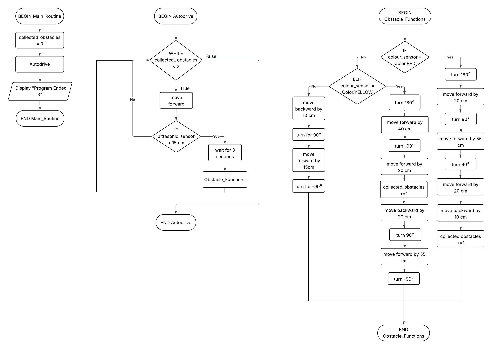

# 9CT Assessment Task 1
### *By Arisa Komatsu*

## **Requirements Outline**
I need to design a program for the EV3 MINDSTORMS robot to allow it to identify and collect the yellow and red blocks back to the start zone using the colour sensor whilst navigating past other blocks using the ultrasonic sensor to detect obstacles and adjust its path automatically.
>### **Key Actions**
>1. Move forward until an obstacle is detected.
>2. Move back and turn 90° from obstacle if the obstacle is green or blue.
>3. Continue moving forward if an obstacle is red or yellow, then turn 180°.
>4. Robot moves forward in a set 'return' path corresponding to colour when red or yellow obstacle is 'captured'.
### **Functional Requirements (of key actions)**
>1. Obstacle Detection - Use Case

Scenario: The robot is navigating a path and encounters an obstacle.

Inputs: The ultrasonic sensor detects an object within 10 cm.

Action: The robot moves forward until an obstacle is detected.

Expected Outcome: The robot stops moving.

>2. Green/Blue Obstacle Evasion - Use Case

Scenario: The robot is has stopped moving after encountering an obstacle.

Inputs: The colour sensor detects the obstacle is green or blue.

Action: The robot moves backward, turns 90° from the obstacle, moves 15 cm, then turns 270° and continues moving forward until an obstacle is detected.

Expected Outcome: The robot avoids the green/blue blocks.

>3. Red/Yellow Obstacle Capture - Use Case

Scenario: The robot has stopped moving after encountering an obstacle.

Inputs: The colour sensor detects the obstacle is red or yellow.

Action: The robot moves forward until ultrasonic sensor detects the obstacle is within 0 cm, then turns 180° and continues moving forward until an obstacle is detected.

Expected Outcome: The robot captures the red/yellow obstacle in its 'arms'.

>4. Return Path after Capture - Use Case

Scenario: The robot has 'captured' a red or yellow obstacle (0 cm distance with obstacle).

Inputs: n/a (The colour sensor has already detected if the obstacle is either red or yellow)

Action: The robot moves forward until ultrasonic sensor detects the obstacle is within 0 cm, then turns 180° and continues moving forward until an obstacle is detected.

Expected Outcome: The robot captures the red/yellow obstacle in its 'arms'.
| Test Case | Input     | Expected Output   |
|---------- |---------- |----------------   |
| 1. Obstacle Detection          | Ultrasonic sensor detects obstacle           | The robot stops moving.                  |
| 2. Green/Blue Obstacle Evasion          | Colour sensor detects obstacle is green/blue           | The robot avoids the green/blue obstacle.                  |
| 3. Red/Yellow Obstacle Capture          | Colour sensor detects obstacle is red/yellow          | The robot captures red/yellow obstacle in its 'arms'.                 | The robot captures red/yellow obstacle
| 4. Return Path after Capture | n/a |The robot moves (with red/yellow obstacle) back to start zone, stops and turns 180°.
### **Non-Functional Requirements**
- Efficiency - The robot should be able to complete the task within 2-3 minutes.

- Response Time - The robot should respond to sensor input(for both ultrasonic and colour sensor) within 1 second.

- Accuracy - The red and yellow blocks should be transported back to the start area  with all or most of its area within the box.

- Recognition - The robot should be able to identify when it needs to retrieve one more obstacle(red/yellow).


## **Design**
### **Pseudocode Development**
```
    BEGIN Main_Routine
        collected_obstacles = 0
        Autodrive
        Display "Program Ended :3"
    END Main_Routine
```
```
    BEGIN Autodrive
        WHILE collected_obstacles < 2 THEN
            move forwar
            IF ultrasonic_sensor < 15 cm THEN
                wait for 3 seconds
                Obstacle_Functions
            END IF
        END WHILE
    END Autodrive
```
```
    BEGIN Obstacle_Functions
        IF colour_sensor = Color.RED THEN
            turn 180°
            move forward by 20 cm
            turn 90°
            move forward by 55 cm
            turn 90°
            move forward by 20 cm
            move backward by 10 cm
            collected_obstacles += 1
        ELIF colour_sensor = Color.YELLOW THEN
            turn 180°
            move forward by 40 cm
            turn -90°
            move forward by 20 cm
            collected_obstacles += 1
            move backward by 20 cm
            turn 90°
            move forward by 55 cm
            turn -90°
        ELSE 
            move forward by -10 cm
            turn 90°
            move forward by 15 cm
            turn -90°
        END IF
    END Obstacle_Functions
  
```
**Note -**
 I  made the program so it uses the ultrasonic sensor to detect and avoid an obstacle, bring the yellow obstacle back to the start zone and move deliberately adjacent to the red obstacle before it goes to the start of the while loop so it can autodrive directly towards it.

### **Flowchart Development**


## **Development and Integration**
hammydamdumdamdom


## **Testing and Debugging**
###  1. Obstacle Detection
| Input | Process | Output|
|---------- |---------- |----------------   |
| Ultrasonic sensor detects obstacle within 15 cm distance | The robot stops, reverses | The robot avoids the obstacle

```
# TEST 1
# Play a beep sound to signal the program has started
ev3.speaker.beep()

# The robot drives continuously unless an obstacle is detected to be within 15 cm
while True:
    robot.drive(200, 0)
    
# If an obstacle is detected within 15 cm, the robot waits 3 seconds, goes back 10 cm, turns to the right, drives 25 cm then turns back to the left to begin driving continuously again.
    if obstacle_sensor.distance() < 150: 
        wait(3)
        robot.straight(-100)
        robot.turn(90)
        robot.straight(250)
        robot.turn(-90)

```
The robot didn't detect the wall fast enough and started rotating and moving on the wall. I think I need to probably make the "obstacle_sensor.distance()" larger so the robot can detect obstacles quickly without bumping into them.

**Working Towards:**
- Making the "obstacle_sensor.distance()" larger so the robot can detect obstacles more quickly
- Changing the "while True" later to "while collected_obstacles < 2" later when I start combining all the test cases.

```
# TEST 2
# Play a beep sound to signal the program has started
ev3.speaker.beep()

# The robot drives continuously unless there's a break in the loop
while True:
    robot.drive(200, 0)

# If an obstacle is detected within 30 cm, the robot waits 3 seconds, goes back 10 cm, turns to the right, drives 15 cm then turns back to the left to begin driving continuously again.
    if obstacle_sensor.distance() > 300:
        wait(3)
        robot.straight(-100)
        robot.turn(90)
        robot.straight(150)
        robot.turn(-90)
```
>**LATER NOTE:**
 This test case was going to be joined with the green/blue obstacle evasion in the end but we have decided to go with another plan so we will only be needing the first half of this code with the robot driving, detecting the obstacle and pausing.

###  2. Green/Blue Obstacle Evasion
| Input | Process | Output|
|---------- |---------- |----------------   |
| Ultrasonic sensor detects obstacle within 15 cm distance + Colour sensor detects the obstacle is green or blue | Robot reverses, moves sideways, then returns to original path | Robot evades green and blue obstacles
```
# TEST 1
# Play a beep sound to signal the program has started
ev3.speaker.beep()

# The robot drives continuously unless there's a break in the loop
while True:
    robot.drive(200, 0)

    # If an obstacle is detected within 30 cm, wait 3 seconds
    if obstacle_sensor.distance() < 300:
        wait(3)
        # If the colour sensor detects blue, beep twice then break the while loop
        if colour_sensor.color() == Color.BLUE:
           ev3.speaker.beep()
           ev3.speaker.beep()
           break
        # If the colour sensor detects green, beep twice then break the while loop
        elif colour_sensor.color() == Color.GREEN:
           ev3.speaker.beep()
           ev3.speaker.beep()
           ev3.speaker.beep()
           break
        else:
           ev3.speaker.beep()
           break
```
I want to begin this test case by first figuring out how to use the colour sensor to make it detect the green and blue obstacles. We tested the code but it goes straight to the else statement, so the issue is probably in how I wrote "colour_sensor.color() == Color.X". 

I did some research and found that the distance and sensor should be pretty close for accurate colour detection so I'll decrease the "obstacle_sensor.distance" as well.

**Working Towards:**
- Figuring out how to make the colour sensor detect both green and blue
- Changing the code to fit my original program plan once I identify and fix the issue (with the colour sensor).

```
# TEST 2
# Play a beep sound to signal the program has started
ev3.speaker.beep()

# The robot drives continuously unless there's a break in the loop
while True:
    robot.drive(200, 0)

    # If an obstacle is detected within 15 cm, wait 3 seconds
    if obstacle_sensor.distance() < 150:
        wait(3)
        # If the colour sensor detects blue, beep twice then break the while loop
        if colour_sensor.color() == Color.BLUE:
           ev3.speaker.beep()
           ev3.speaker.beep()
           break
        # If the colour sensor detects green, beep three times then break the while loop
        elif colour_sensor.color() == Color.GREEN:
           ev3.speaker.beep()
           ev3.speaker.beep()
           ev3.speaker.beep()
           break
        else:
           ev3.speaker.beep()
           break
```
We changed the distance to 15 cm, but it still goes to the else statement when we have a green or blue obstacle, so I think its most likely a problem with how I wrote the if and elif statements. I think I'll do some more research on how to write codes that make the colour sensor detect colour then I'll come back and continue testing this out.

**Working Towards:**
- Researching out how to make the colour sensor detect both green and blue
- Changing the code to fit my original program plan once I identify and fix the issue (with the colour sensor).

```
# TEST 3
# Play a beep sound to signal the program has started
ev3.speaker.beep()

# The robot drives continuously unless there's a break in the loop
while True:
   colour = colour_sensor.color()
   robot.drive(200, 0)

    #if obstacle_sensor.distance() < 300:
      #wait(3)
    # If the colour sensor detects blue, beep twice then break the while loop
   if colour == Color.BLUE:
      ev3.speaker.beep()
      ev3.speaker.beep()
      break
    # If the colour sensor detects green, beep three times then break the while loop
   if colour == Color.GREEN:
      ev3.speaker.beep()
      ev3.speaker.beep()
      ev3.speaker.beep()
      break
   #else:
      #ev3.speaker.beep()
      #break
```
We receives some help from Mr Scott and the colour sensor works now! Contrary to my previous guesses, the problem wasn't entirely the our code's fault. By isolating just the code that detects the colour and working with that, he found that the colour sensor on our EV3 robot was on light detecting mode instead of colour, which is why our code wouldn't work. 

With his help, now we can start working on adapting this code into our program so the robot can evade blue and green obstacles.

**Working Towards:**
- Changing the code to fit my ~~original~~ new program plan.


>**LATER NOTE:**
 We changed our idea from here so green/blue obstacle evasion, but we'll probably use the stuff we learnt from testing this in capturing the red and yellow obstacles. However, this test case will ***probably not be in our final program*** as its a bit unnecessary, especially because we had to change the way our robot goes around the path. The reason why we had to change the robot's path is because:
> - it's too complicated and takes a lot of testing, and we don't have enough time for that
> - our initial pathway we planned to take that included avoided an obstacle doesn't allow enough space for the colour sensor to detect the obstacle's colour without bumping into the obstacle we avoided

### 3. Red/Yellow Obstacle Capture
```
# TEST 1
collected_obstacles = 0

# Play a beep sound to signal the program has started
ev3.speaker.beep()

while collected_obstacles < 2:
  colour = colour_sensor.color()
  robot.drive(200, 0)


  if obstacle_sensor.distance() < 300:
      wait(3)
      if colour == Color.YELLOW:
         robot.straight(100)
         robot.turn(225)
         robot.straight(200)
         robot.turn(140)
         robot.straight(120)
         robot.straight(-30)
         collected_obstacles += 1
```
After testing the robot capturing the yellow, we realised that our colour sensor can't detect the colour from the way we were trying to go as one of the obstacles are in the way. Due to this, we now have to scratch our original plan (and probably the obstacle evasion) and start first by collecting the red obstacle from the left, then the yellow. We also found out that the robot doesn't turn 180 or 90 degrees accurately on the sheet (maybe because of the texture??) so this is actually going to require more testing and time. 

**Working Towards:**
- Getting the robot accurately to the red obstacle (QUICKLY!!)
- Creating the robot's arms so we can afterward start tesing out the robot capturing the red obstacle (by turning 180)

```
# TEST 2
# Display ":3" and play a beep sound to signal the program has started
ev3.screen.draw_text(40, 50, ":3")
ev3.speaker.beep()

# The robot drives up so its facing the red obstacle
robot.straight(200)
robot.turn(107)
robot.straight(595)
robot.turn(107)

while True:
   # Robot autodrives using the while code
   robot.drive(50, 0)
   # Once it detects an obstacle within 10 cm
   if obstacle_sensor.distance() < 100:
      wait(2)
      # The robot's screen displays "Obstacle Detected! :0"
      ev3.screen.clear()
      ev3.screen.draw_text(40, 50, "Obstacle Detected! :0")
      break

# If that obstacle is red
if colour_sensor.color() == Color.BLUE:
   # The robot's screen displays "RED Detected! :3"
   ev3.screen.clear()
   ev3.screen.draw_text(40, 50, "RED Detected! :3")
   robot.straight(100)
   robot.turn(196)
   wait(3)      
```      
It goes up to the red obstacle (we had to substitute it for a blue one at the time) and starts auto-driving and checking for an obstacle. For some reason its not really stopping so I'm not sure if it's detecting the obstacle, so we'll mainly be working on it detecting the obstacle and colour next lesson while still tweaking the robot going up to the obstacle. I'm glad we put the screen displays in as it adds a bit of like structure to the code and makes it easier to see which code is for which function.

Yuna also made the arms for us today! We had to adjust it so one of the arms is on the outside of the colour sensor so it when it detects a yellow or red obstacle, it can go straight forward and actually get it inside its arms. I think it's really stable and awesome so I'm hoping it won't need any tweaks later on.

**Working Towards:**
- Further refining the robot's pathway to the red obstacle so it can accurately detect
- Fixing the code so the robot detects the obstacle and stops
- Getting up to testing if the colour sensor is actually working

### 4. Return Path after Capture
(work on in class)
## **Evaluation**
### **Peer Evaluation**
#### **VANESSA**
When rating 1-5 with 1 being lacklustre effort and 5 being outstanding effort, how much effort do you feel this group member put into this project?

5/5

Explain the reason for this score in detail:
Although she was away for a wqhile she caught up quickly with out plans and put a lot of effort into contributing even if she wasn't comprehending our ideas and stuff.


When rating 1-5 with 1 being not at all and 5 being an exceptional amount, how much did this team member contribute to the team's efforts throughout this project?

3.8/5

Explain the reason for this score in detail:
She fixed a lo9t of our ideas when even we were confused like in th and made things less complicated about what we wrote and she helped make our arms and 


When rating 1-5 with 1 being entirely non-functional and 5 being completely functional, how effective was this team member's final test case? (our test case)

3/5

Explain the reason for this score in detail:
its pretty okay, i think its a bit too complicated in some areas but thats because the map set out a lot of difficulties and challengies


When rating 1-5 with 1 being not well at all and 5 being exceptionally well, how well do you think this team member performed throughout all stages of the project?

*/5
### **Individual Project Evaluation** _(in relation to peer evaluation)_
1. Achievement of functional and non-functional requirements
2. Final Performance
3. Project Management
4. Suggestions for future improvement 